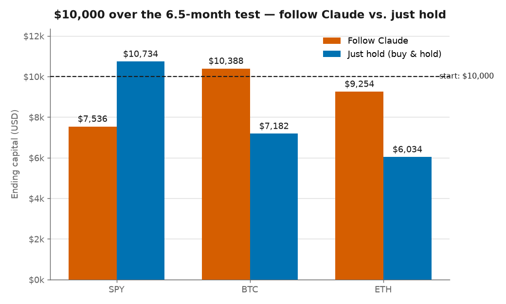
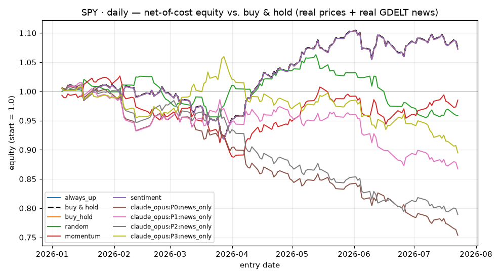
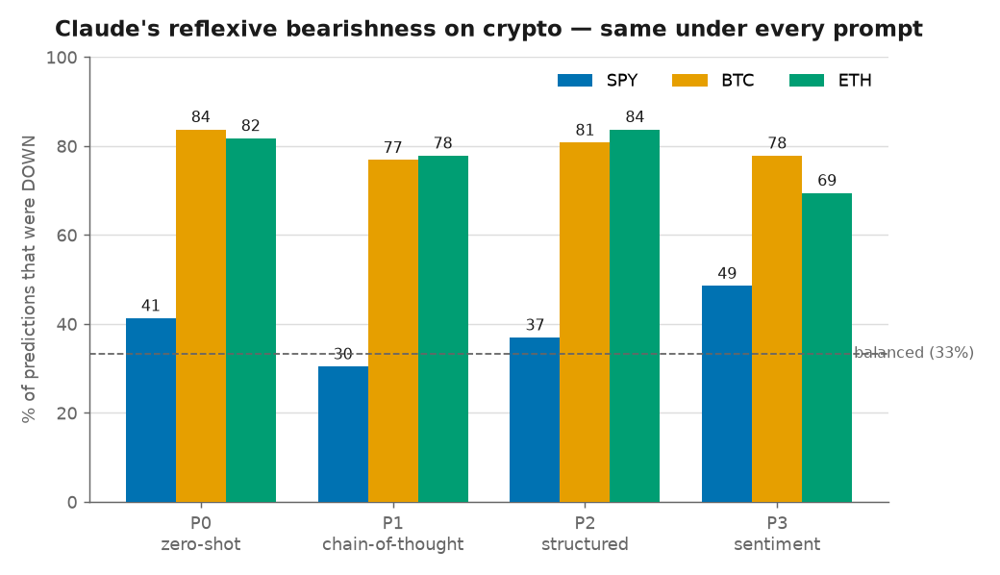

# llm-market-oracle

**Can an LLM read the news and predict the market?** A rigorous, backtested
experiment measuring LLM directional-prediction skill (up / down / stay) against
the market itself, across daily, weekly, and monthly horizons — for SPY, BTC,
and ETH.

The full design lives in [`PRD.md`](PRD.md). This README is the short version
and the reproduction guide.

---

## The question, honestly asked

Does an LLM, given **only the news that was actually available at a point in
time**, have real skill at predicting whether a market goes up, down, or stays
flat over the next day / week / month — and is that skill good enough to beat
the market itself, after costs?

Most "ChatGPT beats the market" content fails on one of three counts, and this
repo is built to avoid all three:

1. **Lookahead / leakage** — testing on a period the model already saw in
   training. → We test on **post-training-cutoff** news and enforce a central
   point-in-time gate (`published_at < as_of`), guarded by a leakage test that
   fails the build if any future data leaks in.
2. **No honest baseline** — 55% accuracy sounds great until you learn the market
   rises ~53% of days. → We measure against **strong baselines** (always-up,
   stratified-random, momentum, buy-and-hold, off-the-shelf sentiment) and the
   **Pesaran–Timmermann** skill test, never raw accuracy.
3. **No costs / no risk adjustment** — paper profits that vanish after fees. →
   Every economic number is **net of transaction costs**, risk-adjusted
   (Sharpe / Sortino / max drawdown), vs. buy-and-hold.

The honest result may well be humbling — and that's a valid, publishable outcome.

---

## Headline finding (first result): no, it does not beat the market

We ran **Claude Opus 4.8** reading only point-in-time news (prompt P0, zero-shot),
**daily** horizon, net of costs, over a real post-cutoff clean window
(2026-01-01 → 2026-07-23; SPY n=138, BTC/ETH n=203). Claude vs. the baselines:

| Asset | Claude acc | Best baseline acc | Claude PT p (FDR q) | Claude Sharpe | Buy&Hold Sharpe |
|---|---|---|---|---|---|
| **SPY** | 27.5% | 41.3% (random) | 0.86 (0.94) | **−3.70** | **+1.01** |
| **BTC** | 29.6% | 29.6% (Claude) | 0.39 (0.94) | +0.32 | −0.85 |
| **ETH** | 29.1% | 33.0% (random) | 0.56 (0.94) | +0.08 | −0.92 |

**No statistically significant directional skill on any asset** (every
Pesaran–Timmermann p ≫ 0.05; every FDR-adjusted q ≈ 0.94), and Claude's 3-class
accuracy is **below the naive baselines**.

- **SPY (a rising market): Claude loses badly.** It repeatedly shorted an index
  that rose +12.8%, posting a −3.70 Sharpe. This is the STOCKBENCH / H2 result.
- **Crypto looks like a win but isn't skill.** Claude beat buy-and-hold on BTC/ETH
  **only because it is reflexively bearish** — it predicted DOWN 84% of the time
  on BTC and 82% on ETH, and crypto happened to fall. A standing short bias
  mechanically profits in a bear market; PT confirms no timing skill, and had
  crypto risen it would have lost as badly as on SPY. **This is exactly the false
  "edge" the significance tests + prediction-distribution audit exist to catch.**

Full write-up and equity curves: [`results/llm_sweep/SUMMARY.md`](results/llm_sweep/SUMMARY.md).

### The result in three charts

**$10,000 followed through the 6.5-month test — following Claude vs. just holding.**
On the S&P 500 you'd end with **$7,536 vs. $10,734**. On crypto both fall, but
Claude's permanent short bias happens to cushion a falling market (that's luck,
not skill — see the third chart):



**On SPY it shorted a market that kept rising** (Claude in brown vs. buy & hold dashed):



**Its crypto "win" is a reflexive bearish bias — identical under every prompt**, not skill.
It calls crypto DOWN ~80% of the time whether zero-shot or reasoning step-by-step;
in a falling market that mechanically "profits," but it would have lost just as
badly had crypto risen (as it did on SPY):



*(Risk-adjusted, the same story: Sharpe is −3.70 for following Claude on SPY vs.
+1.01 for holding — see [`results/figures/summary_sharpe.png`](results/figures/summary_sharpe.png).)*

**The result is robust across prompts.** The full daily **news-only** prompt
sweep (P0 zero-shot, P1 chain-of-thought, P2 structured-analyst, P3 sentiment)
is complete: **no prompt achieves significant skill** (every FDR q ≈ 0.94), and
the reflexive crypto bearishness is **structural, not a prompt artifact** —
Claude calls BTC/ETH DOWN ~77–84% of the time under *every* prompt, including
step-by-step reasoning:

| Asset | P0 | P1 (CoT) | P2 (structured) | P3 (sentiment) |
|---|---|---|---|---|
| BTC DOWN-share | 84% | 77% | 81% | 78% |
| ETH DOWN-share | 82% | 78% | 84% | 69% |

**The null result is genuine — not contamination.** Both input conditions
(news-only and news+price) are complete: **0 of 24 cells** (4 prompts × 3 assets
× 2 conditions) show significant skill. And the at-scale memorization probes
(§7.3, 40 samples/asset) confirm the result is real, not leakage
([`results/probes_summary.md`](results/probes_summary.md)):

| Probe | Result | Meaning |
|---|---|---|
| **Future-trivia** | Claude answered UNKNOWN **0/120** post-cutoff dates | zero memorization — it doesn't know the test period |
| **Placebo-news** | 35–50% of predictions change on mismatched news | it genuinely reads the news (just predicts poorly) |
| **Date-masking** | no accuracy drop when all dates hidden | not keying on remembered calendar dates |

**Scope & honesty.** One model, one ~6.5-month window, daily horizon, coarse
monthly news coverage. Results are a time-stamped snapshot, not a law about
markets — but within that scope the conclusion is robust across prompts, input
conditions, and the fairness probes.

---

## Status

| Phase | State |
|---|---|
| 0. Design sign-off (`PRD.md`) | ✅ |
| **1. Scaffold + data pipeline + leakage test** | ✅ **done** |
| **2. Baselines + backtest engine + committed baseline results** | ✅ **done** |
| **3. LLM harness (Claude Max subscription, no API key)** | ✅ **done** |
| **4. Full sweep (24 cells) + robustness + memorization probes** | ✅ **done** |
| **5. Analysis + write-up (results, figures, summaries)** | ✅ **done** |
| **6. Public-readiness (secret scan, pre-commit hook)** | ✅ **done** |

Phase 1 ships: the source-agnostic market/news providers, the point-in-time
gate, up/down/stay labeling, the shared prediction schema, all five baselines,
and a leakage test that goes red if future data ever leaks.

Phase 2 ships: the walk-forward engine, the portfolio / costs / execution-lag
economic lens, the full metrics suite (Pesaran-Timmermann, Diebold-Mariano,
Brier, Sharpe / Sortino / max-drawdown, Newey-West HAC), and a one-command run
that produces **committed baseline results** — the market bar the LLM must beat.
See [`results/baseline_results.md`](results/baseline_results.md) and
`results/figures/`.

Phase 3 ships: the LLM harness — Claude driven through `claude -p` on your
**Max subscription (no API key)**, the frozen P0–P3 prompt templates, an
on-disk response cache keyed by `(model, prompt, news_ids)`, usage-limit
retry/backoff, and a `--dry-run` that reports how many Claude calls a run would
make before spending any. Claude slots into the exact same walk-forward + scoring
loop as the baselines. Smoke-tested end-to-end against a live subscription.

```bash
python -m src.run --dry-run --llm-model claude_opus --smoke   # count calls, make none
python -m src.run --llm --llm-model claude_opus --smoke \
    --assets SPY --prompts P0 --llm-limit 5                    # a small real run
```

Phase 4 (in progress) ships the **lookahead / memorization probes** (`src/probes/`,
PRD §7.3) — the last fairness piece, which actively tests whether any LLM edge is
genuine reasoning or memorized future:

- **date-masking** — hide all dates; if accuracy collapses, the model was keying
  on remembered dates.
- **placebo-news** — feed mismatched-date news; skill should fall to chance and
  predictions should *change* (proving the model reads the news).
- **future-trivia** — ask the model to *recall* real outcomes; high recall means
  it already knows the test period (contamination).

```bash
python -m scripts.run_probes --asset SPY --limit 20            # real Claude
python -m scripts.run_probes --asset SPY --limit 20 --dry-run  # count calls only
```

Phase 4 also ships **robustness** for the baselines (`scripts/run_robustness.py`
→ [`results/robustness.md`](results/robustness.md)): θ band-width sensitivity
(results across `k ∈ {0.25, 0.5, 1.0}`) and rolling-window decay (per-sub-period
accuracy + Sharpe, exposing non-stationarity, H4).

The full daily LLM sweep (all prompts × both conditions, ~3,800 Claude calls)
was run end-to-end on the Max subscription, self-paced under the usage limit
(window-aware budget in `config/experiment.yaml`; `scripts/run_ab_auto.sh`).

> **Data is real.** Committed prices are real (SPY via Yahoo, BTC/ETH via
> Binance); committed news is a real GDELT corpus with leakage-safe timestamps —
> see [`data/README.md`](data/README.md) and `data/news/MANIFEST.json`. Run
> `python -m scripts.verify_fairness` to audit it yourself.

---

## Reproduce

```bash
python3 -m venv .venv && source .venv/bin/activate
python -m pip install -e ".[dev]"        # or: pip install -r requirements.lock.txt

python -m pytest -q                       # 72 tests incl. leakage + ingestion suites
python -m scripts.verify_fairness         # audit the committed news corpus for leakage
python -m src.run                         # baseline sweep -> results/ (md, csv, figures)
#   python -m src.run --smoke             # daily horizon only (quick)

# refresh the committed real snapshots (network; optional):
#   python -m scripts.fetch_real_prices   # SPY (Yahoo) + BTC/ETH (Binance), no key
#   python -m scripts.fetch_real_news     # GDELT corpus, paced (~9 min), no key
```

No secrets, no API keys, no network required. The LLM path (Phase 3) runs on a
**Claude Max subscription via Claude Code** — still no API key (PRD §13.4).

---

## Layout

```
config/experiment.yaml   every knob: assets, horizons, θ band, costs, models, windows
src/
  data/                  market + news providers, and assemble_context.py (THE gate)
  predictors/            shared Prediction schema, five baselines, and the
                         LLM harness (prompts P0-P3, claude_cli client, cache)
  labeling.py            up/down/stay neutral-band logic
  data/gdelt.py          real GDELT news ingestion (leakage-safe seendate)
  data/quality.py        corpus quality gates: dedup, UTC, future-ts guard
  backtest/              walk-forward engine, portfolio, metrics   (Phase 2)
  probes/                lookahead / memorization probes            (Phase 4)
  report/                tables + plots + results markdown          (Phase 5)
data/prices              committed REAL snapshots (Yahoo / Binance)
data/news                committed REAL GDELT corpus + MANIFEST.json provenance
scripts/                 fetch_real_prices, fetch_real_news, verify_fairness
tests/                   unit tests, incl. the leakage test that FAILS on leakage
```

---

## Fairness safeguards (why you can trust the numbers)

- **One gate for all news.** `src/data/assemble_context.py` is the only path
  news reaches a predictor; it enforces `published_at < as_of` centrally and
  records the exact `news_ids` used, so every prediction is auditable.
- **Leakage-safe news timestamps.** Real news comes from GDELT, and we use its
  `seendate` (when GDELT first *observed* the article) as `published_at`. That
  is always **at or after** real publication, so it can only withhold an article
  longer than reality — never reveal it early. See `src/data/gdelt.py`.
- **Quality-gated corpus.** Every fetched item is de-duplicated, forced to UTC,
  and dropped if its timestamp is after the fetch instant (a physically
  impossible article). See `src/data/quality.py` and `data/news/MANIFEST.json`.
- **Auditable in one command.** `python -m scripts.verify_fairness` re-checks the
  committed corpus for future timestamps, gate leakage, and the clean
  (post-cutoff) vs. contaminated split — and exits non-zero on any violation.
- **Post-cutoff clean window** is the only headline. Pre-cutoff runs are labeled
  "contaminated — upper bound" and never blended in.
- **Strong baselines + significance tests**, not raw accuracy.
- **Net-of-cost economics** as the only headline P&L number.

See PRD §7 for the full list.

---

## License & disclaimer

MIT (see `LICENSE`). This is a **research measurement, not financial advice** and
not a trading system. Results are a time-stamped snapshot of a capability, not a
law about markets.
